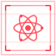
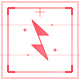
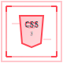
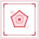

# Dave Mark Candar - Portfolio

<div align="center">
  
  
  
  
  
</div>

A modern, responsive portfolio website built with React and Vite, featuring a Valorant-inspired design aesthetic.

## Features

- **Responsive Design**: Optimized for all device sizes
- **Modern UI**: Clean, professional interface with tactical/gaming elements  
- **Interactive Components**: Smooth navigation and engaging user experience
- **Performance Optimized**: Built with Vite for fast loading and development

## Tech Stack

- **Frontend**: React 19.1.0
- **Build Tool**: Vite 7.0.4
- **Styling**: CSS3 with custom animations
- **Development Tools**: ESLint for code quality

## Project Structure

```
portfolio/
├── src/
│   ├── components/
│   │   ├── Navigation.jsx    # Main navigation component
│   │   ├── Hero.jsx         # Hero/landing section
│   │   ├── Skills.jsx       # Skills showcase
│   │   ├── Projects.jsx     # Projects portfolio
│   │   └── Contact.jsx      # Contact information
│   ├── assets/
│   │   ├── icons/          # Custom SVG icons
│   │   ├── dave-avatar.png # Profile image
│   │   └── Valorant Font.ttf # Custom font
│   ├── App.jsx             # Main application component
│   └── main.jsx            # Application entry point
├── public/                 # Static assets
└── dist/                  # Built application
```

## Getting Started

### Prerequisites

- Node.js (version 16 or higher)
- npm or yarn

### Installation

1. Clone the repository:
```bash
git clone <repository-url>
cd portfolio
```

2. Install dependencies:
```bash
npm install
```

3. Start the development server:
```bash
npm run dev
```

4. Open your browser and navigate to `http://localhost:5173`

## Available Scripts

- `npm run dev` - Start development server
- `npm run build` - Build for production
- `npm run preview` - Preview production build
- `npm run lint` - Run ESLint for code quality

## Sections

- **Hero**: Introduction and main call-to-action
- **Skills**: Technical skills and expertise
- **Projects**: Portfolio of work and achievements
- **Contact**: Contact information and social links

## Design Theme

The portfolio features a modern design inspired by tactical/gaming aesthetics, with:

- Custom tactical shapes and scan line effects
- Professional color scheme
- Smooth animations and transitions
- Responsive layout for all devices

## Contact

Dave Mark Candar - [Your Contact Information]

---

Built with ❤️ using React and Vite